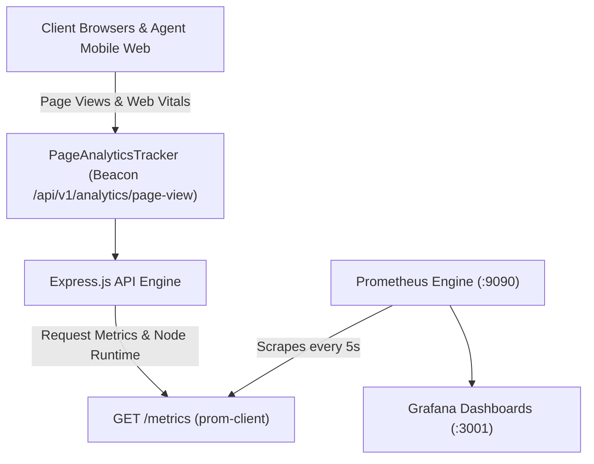

# Enterprise Observability & Monitoring Guide (Prometheus + Grafana)

The **Loan Verification Management System (LVMS)** features a full-stack, enterprise-grade observability architecture designed for high concurrent user loads (thousands of field agents, branch managers, and credit risk admins).

---

## 1. End-to-End Architecture



---

## 2. Five Pre-Configured Grafana Production Dashboards

When you start the stack with `docker compose up -d`, Grafana automatically provisions all 5 production dashboards under the **`LVMS Production Analytics`** folder:

### 📊 Dashboard 1: Infrastructure & Runtime Health (`1_infrastructure_health.json`)
*Answers: How much CPU, RAM, and server capacity are being consumed under heavy traffic?*
- **CPU Usage (%)**: Real-time Node.js CPU utilization with warning (>70%) and critical (>90%) thresholds.
- **Memory Consumption**: Compares **Heap Used**, **Heap Allocated**, and **Resident Set Size (RSS)** over time to detect memory leaks.
- **Event Loop Lag**: Detects server stutter or blocking computations when hundreds of agents submit cases simultaneously.
- **Garbage Collection Frequency**: Rate of V8 garbage collection cycles.

### ⚡ Dashboard 2: API Performance & Route Latencies (`2_api_performance.json`)
*Answers: Which API endpoints cause slowdowns, and which routes return 400, 401, 403, 429, or 500 errors?*
- **Requests Per Second (RPS)**: Live traffic volume across all routes.
- **p50, p95, and p99 Response Latency**: Tail latency analysis across every route.
- **Slowest Endpoints Ranking**: Bar gauge highlighting the top 8 slowest API endpoints.
- **HTTP 4xx & 5xx Error Heatmap**: Error spikes broken down by status code (`400`, `401`, `403`, `429`, `500`).
- **Security Events**: Rate-limiting throttles and brute-force authentication blocks.

### 🏆 Dashboard 3: Page Usage & User Experience (`3_page_usage_experience.json`)
*Answers: Which page is used most frequently, which page is least used, and which page is getting errors?*
- **Top 10 Most Visited Pages**: Live ranking (e.g. `/agent/verify`, `/app/cases`, `/app/customers`, `/app/verification`).
- **Least Visited Pages**: Underutilized pages that users rarely open.
- **Page Load & Render Duration**: Real rendering latency measured on client browsers.
- **Core Web Vitals**: LCP (Largest Contentful Paint) and CLS (Cumulative Layout Shift) scores per page.
- **Pages Getting Errors**: Real-time table of frontend crashes and JavaScript exceptions by route.
- **Role Breakdown**: Percentage of traffic coming from **Field Agents** vs. **Admins**.

### 🐘 Dashboard 4: PostgreSQL & Redis Health (`4_db_and_redis.json`)
*Answers: Are database connections exhausted or Redis cache failing?*
- **Database Query Throughput**: Active transaction rates.
- **Connection Pool Utilization**: Number of active handles and pool pressure.
- **Redis Cache Operations**: Rates of cache hits, misses, and set operations.
- **Redis Operational Status**: Live health indicator.

### 📍 Dashboard 5: Business Workflows & Field Telemetry (`5_business_workflows.json`)
*Answers: How many agents are actively sending GPS pings, how long do Excel imports and PDF reports take?*
- **GPS Telemetry Throughput**: Real-time pings/second accepted vs. rejected from field agents on active rides.
- **Case Submissions by Loan Profile**: Distribution across all 12 custom verification profiles (Residential, Business, Agriculture, DSA, etc.).
- **Bulk Excel Leads Ingestion**: Number of borrower records processed successfully vs. rejected.
- **RCU Report Generation Duration**: Time taken to assemble multi-page PDF & DOCX reports with photos and geo-tags.
- **Security Audit Blocks**: 24-hour history of rate-limited or blocked IP attempts.

---

## 3. How to Launch & View

### 1. Start with Docker Compose
```bash
docker compose up -d
```

### 2. Access Dashboards
- **Grafana URL**: `http://localhost:3001` (or `http://<your-server-ip>:3001`)
  - **Username**: `admin`
  - **Password**: `admin_secure_pass`
- **Prometheus URL**: `http://localhost:9090` (or `http://<your-server-ip>:9090`)
- **Direct Metrics Endpoint**: `http://localhost:5000/metrics`
