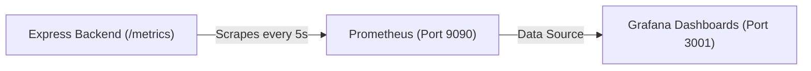

# Observability & Monitoring Guide (Prometheus + Grafana)

The Loan Verification Management System (LVMS) includes built-in observability via **Prometheus** (metrics collection) and **Grafana** (dashboard visualization).

---

## 1. Architecture Overview

---

## 2. Key Metrics Collected from Express API

The Express API now exports standard metrics via `prom-client` at `GET /metrics`:
1. **`http_request_duration_seconds`**: Request latency histograms segmented by route, method, and HTTP status code (`200`, `400`, `500`).
2. **`http_requests_total`**: Live request throughput (RPS - Requests Per Second).
3. **Node.js System Metrics**:
   - Process CPU usage percentage
   - Process Resident Set Size (RSS) and Heap Memory usage
   - Event loop lag & garbage collection pauses
   - Active open handles and socket connections

---

## 3. How to Access Dashboards

When running `docker compose up -d`:
- **Prometheus UI**: `http://localhost:9090` (or `http://<server-ip>:9090`)
- **Grafana UI**: `http://localhost:3001` (or `http://<server-ip>:3001`)
  - **Username**: `admin`
  - **Password**: `admin_secure_pass` (configurable via `docker-compose.yml`)
  - **Datasource**: Pre-provisioned to Prometheus automatically!
